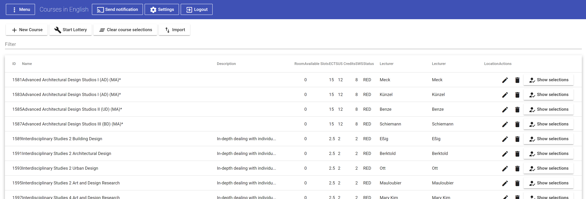
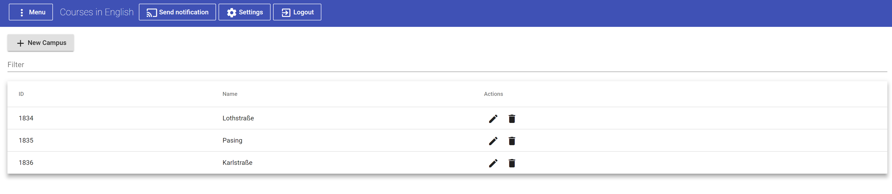
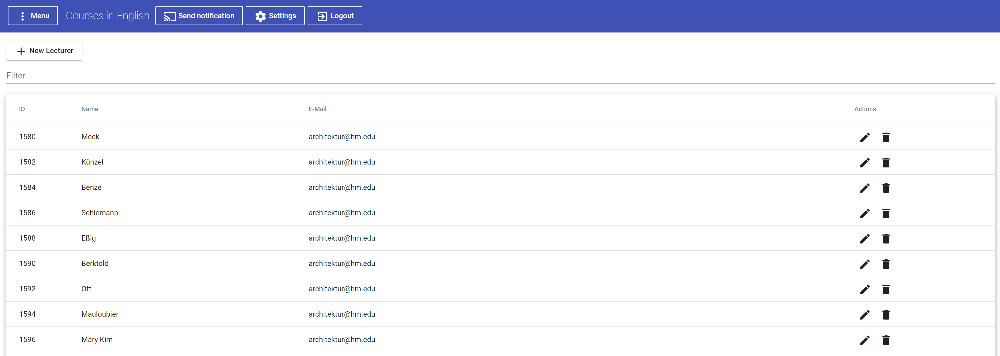
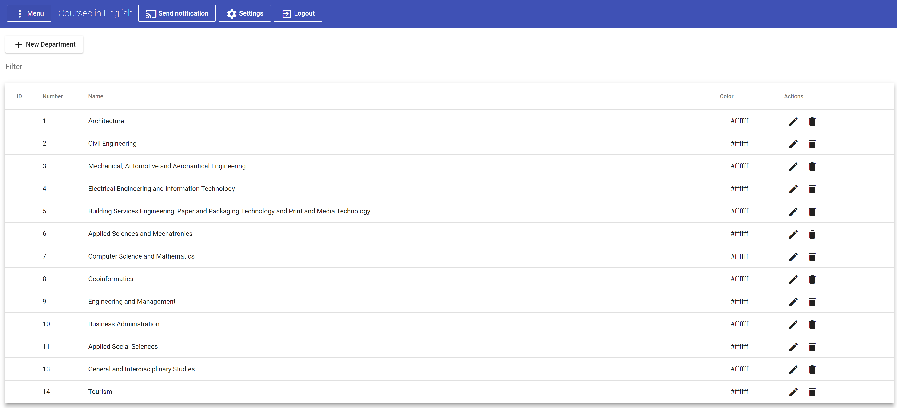

# Courses in English Server and Web Interface

## Current Release (v3.0)

Sprint 3 has been completed and a new version released.
[Look at the Spring Review for Release notes!](https://github.com/mobileappdevhm/cie-server-team-2/wiki/Sprint-3-Review)

## Motivation
Since there was no really "good" solution besides using NINE (nine.wi.hm.edu) for getting the data for courses english, we decided to implement our own solution. It basically consists of a server - exposing a REST API - and a management interface - with which administrators can easily manage and control the apps contents.

## Features
> What is the Server and management interface able to do?

Well, the most important things were some kind of data management in the management interface where you could add/delete/edit/import courses. More over the basics object a course can be associated with should be managable. These are for example lecturers, departments and campuses.

One exception in functionality is the course management where you can see the course selections for individual users, start the course lottery (Where for all overbooked courses random users get kicked and the resulting courses for each user get stored, and are retrievable for each user).

### Course Management

### Campus Management

### Lecturer Management

### Department Management

## Getting started

### Environment variables
The server depends on several environment variables which define API Tokens, the servers port, the database, etc.

You have to look them up in the `application.properties` file in the Spring boot project under `cie-server`.

### Development

#### In subfolder `cie-server`:
- Let maven install
- Launch the Spring server with `CieServerApplication.java`

#### In subfolder `cie-management-app`:
- Run `npm install` from the command line -> Dependencies will be installed
- Run `npm start` from the command line -> Development server is started with proxy so that all HTTP Requests are redirected to the server instead of `localhost:4200` (The default ng serve address)

### Release
In order to build the server and web management interface you can just use the maven goal `clean install -Prelease` (with the `release` profile). Run the maven command in the `cie-server` subfolder. The build process will automatically build the web application and include it into the `resources` folder of the spring application. The resulting server application will be placed in the `cie-server/target` folder.
